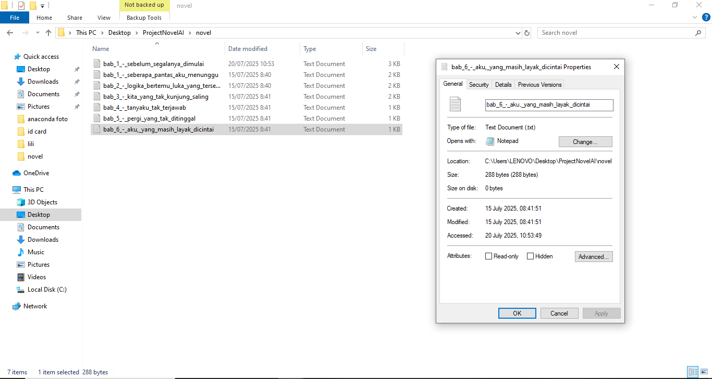

# Novel-AI
Proyek ini adalah eksplorasi menggabungkan kreativitas dan teknologi:
menulis novel pendek dengan bantuan model AI dan dijalankan menggunakan Python.
-----

### 🔧 Tahap 1 – Persiapan Awal
1. **Setup Environment**:

`conda create -n novel-ai python=3.10 -y && conda activate novel-ai]`
Kalau muncul ini:
`Proceed ([y]/n)?`
👉 Kamu cukup ketik:
`y`
lalu tekan Enter
Tunggu sampai selesai (akan download dan setup dependensi).
##### Lanjutkan:

`conda activate novel-ai`

##### Kalau sudah aktif, lanjutkan ke langkah berikutnya.
### ✅ 2. Install Library yang Dibutuhkan
##### Kita butuh transformers, torch, dan accelerate:

`pip install torch transformers accelerate`

##### Ini akan meng-install semua tools utama untuk menjalankan model AI text generation.
##### Tunggu sampai selesai.
### Ini code yang aku simpan di vscode, generate_novel.py

``from huggingface_hub import login
from transformers import AutoTokenizer, AutoModelForCausalLM, pipeline
import os
import re
login("your-token")
MODEL_NAME = "tiiuae/falcon-rw-1b"
def load_model():
    print("Memuat model...")
    tokenizer = AutoTokenizer.from_pretrained(MODEL_NAME)
    model = AutoModelForCausalLM.from_pretrained(
        MODEL_NAME,
        device_map="auto",
        offload_folder="offload"
    )
    generator = pipeline("text-generation", model=model, tokenizer=tokenizer)
    return generator
def generate_chapter(generator, prompt, chapter_title, output_dir="novel"):
    print(f"\n📖 Membuat: {chapter_title}")
    output = generator(prompt, max_new_tokens=900, do_sample=True, temperature=0.9, truncation=True)
    text = output[0]["generated_text"]
    if not os.path.exists(output_dir):
        os.makedirs(output_dir)
    safe_title = re.sub(r'[\\/*?:"<>|]', "", chapter_title)  
    file_path = os.path.join(output_dir, f"{safe_title.replace(' ', '_').lower()}.txt")
    with open(file_path, "w", encoding="utf-8") as f:
        f.write(text)
    print(f"✅ Disimpan di {file_path}\n")
    return text
if __name__ == "__main__":
    generator = load_model()
    chapters = [
        ("Bab 1 - Sebelum Segalanya Dimulai", "Perkenalkan tokoh utama, Azkeyra Liana. Seorang dokter muda yang rasional, belum pernah pacaran karena idealisme dan logikanya sendiri. Ceritakan pertemuan pertamanya yang aneh dengan Bernat Chaniago—seorang pilot pendiam dan misterius yang dikenalkan oleh abangnya."),
        ("Bab 2 - Apa Aku Boleh Menyukaimu", "Gambarkan kebingungan Liana saat mulai menyukai Bernat. Dia bertanya-tanya, apakah boleh membuka hatinya? Buat nuansa reflektif, puitis, dan penuh logika yang mencoba melawan rasa."),
        ("Bab 3 - Obrolan yang Tak Masuk Akal", "Tunjukkan kedekatan mereka yang unik. Obrolan mereka aneh: dari anime, psikologi, filsafat cinta, sampai drama Korea. Tapi anehnya, justru membuat Liana merasa nyambung dan nyaman."),
        ("Bab 4 - Kecewa", "Liana kehilangan ayahnya. Bernat bilang akan datang melayat, tapi tidak muncul. Liana mulai merasa kecewa dan curiga: apakah ia terlalu berharap pada orang yang tidak pernah janji apa-apa?"),
        ("Bab 5 - Pindah, Tapi Tak Selesai", "Setelah pindah kota, Liana bertemu Fahmi, seorang arsitek. Mereka mulai dekat, tapi di tengah proses membuka hati, muncul lagi kabar tentang Bernat. Hati Liana mulai goyah."),
        ("Bab 6 - Antara Rumah dan Rasa", "Liana tahu Bernat dekat dengan Chef Xavenya. Ia cemburu. Tapi sadar bahwa selama ini, ia tidak pernah benar-benar tahu isi hati Bernat. Semua hanya asumsi dan ekspektasi."),
        ("Bab 7 - Aku, yang Akhirnya Menerima", "Ceritakan bagaimana Liana akhirnya memilih menerima kenyataan. Ia tidak ingin menggantungkan hidupnya pada ekspektasi. Ending terbuka: bukan tentang bersama siapa, tapi tentang menemukan dirinya sendiri.")
    ]
    for title, prompt in chapters:
        generate_chapter(generator, prompt, title)``

### 🧠 Tahap 2 – Jalankan Project
`python generate_novel.py`
### 📁 Hasil
Output akan muncul di dalam folder novel dengan format:

├── bab_1_-_sebelum_segalanya_dimulai.txt
├── bab_2_-_apa_aku_boleh_menyukaimu.txt
...
##### 
-----

##### Eksperimen ini menghasilkan beberapa bab novel dalam format .txt, namun hasilnya tidak sesuai ekspektasi, dengan beberapa isu utama:
🔁 Isi cerita tidak jelas dan tidak sesuai
💬 Output terlalu pendek

##### Contoh hasil yang tidak sesuai:

##### Aku menyadari bahwa eksperimen ini belum optimal. Masih dalam proses eksperimen untuk mencari jalan paling benar.
